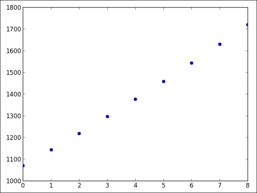

# 七、NumPy 特殊例程

```py
# 来源：NumPy Biginner's Guide 2e ch7
```

## 字典排序

```py
import numpy as np
import datetime

# 日期转成字符串
def datestr2num(s):
    return datetime.datetime.strptime(s, "%d-%m-%Y").toordinal()

# 读取 AAPL 的日期和收盘价
# 并转换日期格式
dates,closes=np.loadtxt('AAPL.csv', delimiter=',', usecols=(1, 6), converters={1:datestr2num}, unpack=True)

# lexsort 接受属性的数组或元组
# 根据这些属性排序，返回下标
# 靠后的属性优先排序
indices = np.lexsort((dates, closes))

print "Indices", indices
print ["%s %s" % (datetime.date.fromordinal(int(dates[i])),  closes[i]) for i in indices]
'''
['2011-01-28 336.1', '2011-02-22 338.61', '2011-01-31 339.32', '2011-02-23 342.62', '2011-02-24 342.88', '2011-02-03 343.44', '2011-02-02 344.32', '2011-02-01 345.03', '2011-02-04 346.5', '2011-03-10 346.67', '2011-02-25 348.16', '2011-03-01 349.31', '2011-02-18 350.56', '2011-02-07 351.88', '2011-03-11 351.99', '2011-03-02 352.12', '2011-03-09 352.47', '2011-02-28 353.21', '2011-02-10 354.54', '2011-02-08 355.2', '2011-03-07 355.36', '2011-03-08 355.76', '2011-02-11 356.85', '2011-02-09 358.16', '2011-02-17 358.3', '2011-02-14 359.18', '2011-03-03 359.56', '2011-02-15 359.9', '2011-03-04 360.0', '2011-02-16 363.13']
'''
```

## 复数排序

```py
import numpy as np

# 生成随机的复数
np.random.seed(42)
complex_numbers = np.random.random(5) + 1j * np.random.random(5)
print "Complex numbers\n", complex_numbers

# sort_complex 按照先实部后虚部的顺序对复数排序
print "Sorted\n", np.sort_complex(complex_numbers)
'''
Sorted
[ 0.39342751+0.34955771j  0.40597665+0.77477433j  0.41516850+0.26221878j
  0.86631422+0.74612422j  0.92293095+0.81335691j]
'''
```

## 使用 searchsorted

```py
import numpy as np

a = np.arange(5)

# searchsorted 的第一个参数 a 是有序数组
# 第二个参数 v 是插入值的数组
# 返回插入值在有序数组中的位置
indices = np.searchsorted(a, [-2, 7])
print "Indices", indices
# Indices [0 5]

# 将这些值插入后，数组也能保持有序
print "The full array", np.insert(a, indices, [-2, 7])
# The full array [-2  0  1  2  3  4  7]
```

## 从数组移除元素

```py
import numpy as np

a = np.arange(7)

# condition 是一个布尔索引
condition = (a % 2) == 0

# extract 从 a 中选取条件为 condition 的元素
# 等价于 a[conditon]
print "Even numbers", np.extract(condition, a)
# Even numbers [0 2 4 6]

# nonzero 选取 a 的非零元素
# 等价于 a[a != 0]
print "Non zero", np.nonzero(a)
# Non zero (array([1, 2, 3, 4, 5, 6]),)
```

## 期值与现值预测

```py
import numpy as np
from matplotlib.pyplot import plot, show

# 期值预测
# fv(rate, n, pmt, pv)
# rate：利率，n：周期数量
# pmt：周期性投入，pv：现值
# 这个例子是计算，假设现在你存了 1000 元，之后每个季度多存 10 元，年利率是 3%，五年之后你有多少钱。
# 负值表示你失去的钱
print "Future value", np.fv(0.03/4, 5 * 4, -10, -1000)
# Future value 1376.09633204

fvals = []

# 计算第 i 年有多少钱
for i in xrange(1, 10):
   fvals.append(np.fv(.03/4, i * 4, -10, -1000))

plot(fvals, 'bo')
show()

# 现值预测
# pv(rate, n, pmt, fv)
# fv 为期值，其它同上
# 这个例子是计算，五年后想得到 1376.09633204 元，其它条件同上，现在应存多少钱。
print "Present value", np.pv(0.03/4, 5 * 4, -10, 1376.09633204)
Present value -999.999999999
# Present value -999.999999999

# 周期性投入预测
# pmt(rate, n, pv, fv=0) 参数含义同上
# 假设你贷款 100 万元，利率为 10%，需要在 30 年内还完，每个月需要还多少呢？
print "Payment", np.pmt(0.01/12, 12 * 30, 10000000)
# Payment -32163.9520447

# 周期数量预测
# nper(rate, pmt, fv, pv=0) 参数含义同上
# 假设你贷款 9000 元，利率为 10%，每个月还 100 元
# 多少个月能还完？
print "Number of payments", np.nper(0.10/12, -100, 9000)
# Number of payments 167.047511801

# 利率
# 假设我们知道除了利率之外的其他参数
# rate(n, pmt, pv, fv)
print "Interest rate", 12 * np.rate(167, -100, 9000, 0)
# Interest rate 0.0999756420664
```




注：

假设现在存入`pv`元钱（正），之后就不存了，年利率为`rate`，`n`年之后余额是`pv * (1 + rate) ** n`。

如果之后每年都往里面存 pmt 元（正），`fv[i] = fv[i - 1] * (1 + rate) + pmt`。

| 年数 | 余额 |
| --- | --- |
| 0 | `pv` |
| 1 | `pv * (1 + rate) + pmt` |
| 2 | `pv * (1 + rate) ** 2 + pmt * (1 + rate) + pmt` |
| 3 | `pv * (1 + rate) ** 3 + pmt * (1 + rate) ** 2 + pmt * (1 + rate) + pmt` |
| n | `pv * (1 + rate) ** n + pmt * ((1 + rate) ** n - 1) / rate` |

`np.fv`中的`pv`和`pmt`是负的，求完之后取相反数即可。

## 计算净现值（NPV）、内部收益率（IRR）

```py
import numpy as np

# 生成五个 100 以内的随机数作为现金流序列
# -100 为初始值
cashflows = np.random.randint(100, size=5)
cashflows = np.insert(cashflows, 0, -100)
print "Cashflows", cashflows
# Cashflows [-100   38   48   90   17   36]

# npv(rate, vals) 计算净现值
# npv = np.sum(vals / (np.ones(length) + rate) ** np.arange(length))
# 其中 l = len(vals)
print "Net present value", np.npv(0.03, cashflows)
# Net present value 107.435682443

# irr(vals) 计算内部收益率
# 满足 npv(irr, vals) == 0
print "Internal rate of return", np.irr([-100, 38, 48, 90,
  17, 36])
# Internal rate of return 0.373420226888
```

## 布林窗口


```py
# 布林窗口是三角平滑窗口
# 参数为 n 的布林函数是 (0,0) 到 (n/2,1) 再到 (n,0) 的线段
# bartlett 函数返回布林窗口函数值的数组，x 范围从 0 到 n
window = np.bartlett(42)
plot(window)
show()
```


## 使用布莱克曼窗口来平滑股票价格


```py
import numpy as np
from matplotlib.pyplot import plot, show, legend
from matplotlib.dates import datestr2num
import sys

# 获取 AAPL 收盘价
closes=np.loadtxt('AAPL.csv', delimiter=',', usecols=(6,), converters={1:datestr2num}, unpack=True)

# 读入天数
N = int(sys.argv[1])

# 创建布莱克曼窗口
window = np.blackman(N)

# 使用卷积函数来平滑收盘价
smoothed = np.convolve(window/window.sum(), closes, mode='same')

# 绘制原始和平滑后的收盘价
plot(smoothed[N:-N], lw=2, label="smoothed")
plot(closes[N:-N], label="closes")
legend(loc='best')
show()
```


## 汉明窗口


```py
# 使用方法同布林窗口
window = np.hamming(42)
plot(window)
show()
```


## 凯撒窗口


```py
# kaiser(M, beta)
window = np.kaiser(42, 14)
plot(window)
show()
```


## 修正贝塞尔函数

```py
x = np.linspace(0, 4, 100)
vals = np.i0(x)
plot(x, vals)
show()
```


## sinc 函数

```py
# sinc(x) = sin(pi * x) / (pi * x)
# 在 0 处取极限值 1
x = np.linspace(0, 4, 100)
vals = np.sinc(x)
plot(x, vals)
show()
```


